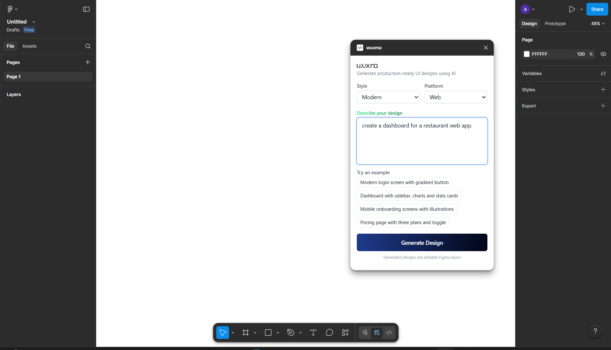

# Wuxma – AI Design for Developers

 
 

  <picture>
    <source media="(prefers-color-scheme: dark)" srcset="wuxma_dark_mode.png">
    <source media="(prefers-color-scheme: light)" srcset="wuxma_2.svg">
    
  </picture>

  

 

Wuxma is an **AI SaaS platform** that helps developers create high‑quality UI designs in minutes. It connects directly to a Figma plugin, turning natural‑language prompts into real, editable layouts. The result: **faster product iteration, lower design overhead, and a dramatically shorter path from idea to interface**.

---

## The Promise

- **Design at the speed of thought**  
  Type what you want. Wuxma delivers a usable layout instantly.

- **Built for developers 💡**  
  No handoffs, no waiting. The output is real Figma structure, ready to tweak or ship.

- **Consistent and repeatable**  
  Deterministic generation means teams can iterate without design drift.

- **AI with guardrails**  
  Prompts translate into structured layouts that stay practical and implementation‑ready.

---

## What It Does

1. A user types a prompt inside the Wuxma Figma plugin.  
2. The plugin sends the prompt to the Wuxma backend.  
3. Wuxma generates a structured JSON response.  
4. The plugin renders a clean, editable design directly in Figma.  

This keeps the plugin lightweight while the intelligence lives in the platform.

---

## Business Model and Growth Drivers

- **SaaS subscription for teams and individuals**
- **Plugin distribution inside the Figma ecosystem**
- **High‑frequency usage** as prompts are part of everyday development
- **Sticky workflows** once teams adopt prompt‑to‑design iteration

---

## Product Differentiation

- **Developer‑first UX** rather than designer‑only workflows
- **Real, editable Figma layers**, not static images
- **Predictable outputs** for reliable design iteration
- **A clear upgrade path** from guest usage to full access

---

## User Journey

### Instant Value
Users can try the product immediately with a few free prompts.

### Conversion
Once the free quota is exhausted, users are guided to a seamless signup flow.

### Full Access
After authentication, the plugin unlocks full generation and ongoing use.

---

## Vision

Wuxma is building the fastest way for developers to go from **prompt to production‑ready UI**. It removes the friction between idea and interface, enabling teams to ship polished products faster.

---
<!-- 
## Traction (Early Signal)

- **X** prompts generated during private beta  
- **Y** teams onboarded  
- **Z%** week‑over‑week growth  

Replace with your latest numbers when ready.

--- -->

## Platform Snapshot

- **Figma plugin** for instant prompt‑to‑design creation  
- **AI‑powered backend** for structured UI generation  
- **Web app** for onboarding and full‑access unlocks  

  

---

## Status

Fully functional plugin and backend, actively iterating and improving. Focused on scaling usage, expanding model quality, and deepening integrations across developer workflows.

---

## Contact

Interested in early access, pilots, or partnerships?  
Email: [hello@wuxma.ai](mailto:hello@wuxma.ai)

---

## License

Private / Proprietary

## Note

Wuxma source code is proprietary. This page only demonstrates the platform. 

## Author
This software was designed and developed by **wuxma AI**
